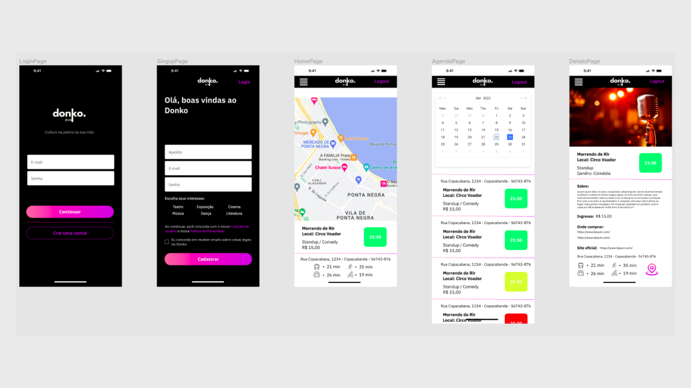

    

# **HACKATHON RIO EMPREENDER CRIATIVO**

## **Projeto DonkoRio**

O Donko é uma aplicação web projetada para ser uma plataforma completa que serve como guia para eventos culturais, desde shows musicais até exposições de arte, teatro e outras opções de entretenimento.

Durante o processo notamos que as principais dores do segmento de arte, cultura e entretenimento, teatro e música, é que atualmente existem diversos sites separados muitas vezes por tema, também não existia um "Guia de Eventos" por localização e menos ainda que tivesse um identificador de preferências. Com isso veio a solução, criar uma plataforma que forneça ao usuário informações sobre eventos culturais em sua área local, facilitando a busca e participação nessas atividades, por geolocalização e interação visual por mapa. Assim visamos o aumento de participação nos eventos locais e de faturamento desse setor no Estado do Rio de Janeiro.

Conheça a plataforma [**DonkoRio**](https://donko-rio.vercel.app/login) e tenha acesso a *Cultura na palma da sua mão* 😉. 

 

#### **Nosso Diferencial:**
* Geolocalização
* Filtros inteligentes que mostram ao usuário possíveis eventos que possam ser de seu interesse conforme sua usabilidade
* Alerta para que o usuário saiba se o evento está longe, perto ou se já começou.
* Interação com plataformas para vendas de ingressos
* Planos mensais com benefícios

 

## 🚀 **Começando**

Essas instruções permitirão que você consiga ter esse projeto em operação na sua máquina local para fins de desenvolvimento e teste.

### 📋 Pré-requisitos para instalação 🔧

* Instale NodeJS em seu computador.
* Baixe os aquivos do repositório hackrio-front aqui no GitHub.escrever sobre o projeto
* Abra a pasta no terminal e de o comando: **npm i**

 

### 📋 Orientações para testes
- Para testar o login você pode utilizar os seguintes usuários:
    - marina@email.com
    - monica@email.com
    - samantha@email.com
    - alexandre@email.com
- A senha é a mesma para todos eles: **123456@Aa**
- Você também pode criar um novo usuário na página de cadastro e testa-lo normalmente.
 

## 📦 **Desenvolvimento**

### 🛠️ Construído com

* [Figma](https://www.figma.com/) - Design UX-UI.
* [Trello](https://trello.com/) - Gestão de Projetos.
* [React](https://pt-br.reactjs.org) - Framework utilizado no Front-end.
* [NodeJS](https://nodejs.org/pt-br/docs/) - Framework utilizado no Back-end.
* [JavaScript](https://developer.mozilla.org/pt-BR/docs/Web/JavaScript) - Linguagem utilizada no Front-end.
* [HTML](https://developer.mozilla.org/pt-BR/docs/Web/HTML) - Linguagem de marcação utilizada no Front-end.
* [CSS](https://developer.mozilla.org/pt-BR/docs/Web/CSS) - Utilizado para estilização das páginas no Front-end.
* [Chakra-UI](https://chakra-ui.com) - Biblioteca de componentes.
* [React-Icons](https://react-icons.github.io/react-icons/)- Biblioteca de ícones.

 

## 📌 **Versão**

Nós usamos o [GitHub](https://github.com/) para controle de versão. 

Foi criado dois repositórios, um para o Front-end e outro para o Back-end. Você pode acessá-los para ver as versões através dos links abaixo.

* [**Repositório - Front-End**](https://github.com/SahBianchi/hackrio-front)
* [**Repositório - Back-End**](https://github.com/Afmjuniors/donko-back)

 

## ✏️ **Aplicação**

    

 

## 📺 **Vídeos de Apresentação**

* <a href="#">Apresentação</a>

* <a href="#">Aplicação</a>

 

---
## ✒️ **Equipe**

🚀 **Mônica Jesus** - *Administração* - [Linkedin](https://www.linkedin.com/in/monicajprado)

💡 **Marina Jaudy** - *UX/UI e Front-End* - [Linkedin](https://www.linkedin.com/in/marina-jaudy/) | [GitHub](https://github.com/marinajaudy)

💻 **Samantha Bianchi** - *Front-end* - [Linkedin](https://www.linkedin.com/in/sahbianchi/) | [GitHub](https://github.com/SahBianchi)

💻 **Alexandre Machado** - *Full-Stack* - [Linkedin](https://www.linkedin.com/in/afmjuniors/) | [GitHub](https://github.com/Afmjuniors)

 

## 🎁 **Expressões de gratidão**

Gostariámos de agradecer ao **Fecomércio RJ** e **SEBRAE** por promover o **HACKATHON RIO EMPREENDER CRIATIVO** e nos dar a oportunidade de compartilharmos nossos conhecimentos e desenvolvermos nossas habilidades na construção desse desafio.

Agradecemos também a toda a equipe e mentores que nos apoiram e auxiliaram durante o desenvolvimento desse projeto.
 

